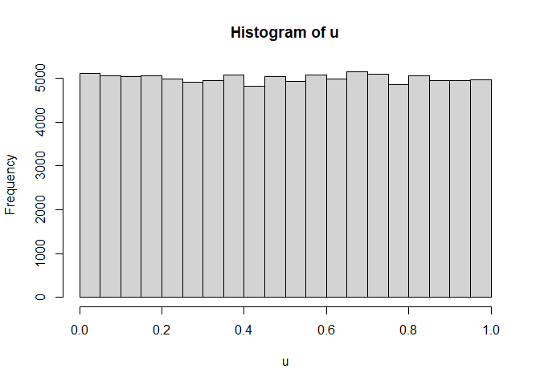
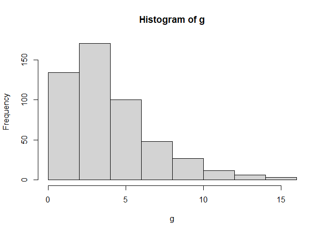

<!-- README.md is generated from README.Rmd. Please edit that file -->

# simulationRNG

<!-- badges: start -->
<!-- badges: end -->

The goal of simulationRNG is to provide a package to generate
psuedo-random number and random variates while given the user access to
the source code for verification, modification, and improvement.

## Installation

This package was developed using R version 4.1, although no functions
should have version dependencies, it does seem to require at least this
version for installation of the package. You can install the latest
released version of simulationRNG using Rstudio with the following
command:

devtools::install\_github(“donovanquimby/simulationRNG”)

The package can also be directly downloaded or cloned from from
<https://github.com/donovanquimby/simulationRNG>.

## Example

This is a basic example which shows you how to solve a common problem:

``` r
library(simulationRNG)

# uniform(0,1) distriubtion
u <- unif(n = 1e5, type = "bfs1987")
hist(u)
```



``` r
# Gamma Distribution
g <- gammaSim(n=5e2, shape =2, scale = 2)
hist(g)
```



``` r
# Multivariate Normal Distribution
cov_matrix = matrix(c(1,0.9,0.9,1), nrow = 2, ncol = 2)
mn <- multiNormal(n=7e2, cov_matrix = cov_matrix,  mu=c(0,0), seed = 122)
plot(mn)
```


